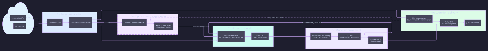

# MSOCR workflow

The production path is the solid flow below. The purple ink-detection branch
is development-only and cannot alter default preprocessing or HTR output until
it improves a frozen holdout's crop quality, annotation time, or CER.

## D2 showcase diagram



Source: [`diagrams/msocr-workflow.d2`](diagrams/msocr-workflow.d2). Regenerate
with:

```bash
d2 docs/diagrams/msocr-workflow.d2 docs/diagrams/msocr-workflow.svg
```

## Mermaid version

```mermaid
flowchart LR
  A[Manuscript source<br/>upload · local file · IIIF] --> B[1 · Page preparation<br/>isolate → enhance → binarise → deskew]
  B --> C[2 · Browser annotation<br/>RTL baseline · polygon · transcript]
  C --> D[PAGE XML<br/>row / gap metadata]
  D --> E[3 · Kraken ketos fine-tuning<br/>local or RunPod GPU]
  E --> F[CER / WER<br/>confusion-matrix diagnosis]
  F -->|more approved ground truth| C
  F --> G[Validated local Kraken model]

  B --> H[Line segmentation<br/>BLLA · row bands · manual review]
  G --> I[Kraken HTR<br/>RTL line recognition]
  H --> I --> J[JSON / Markdown]

  B -. optional .-> X[Experimental ink / substrate / damage mask]
  X -. reviewed suggestions .-> C
  X -. only after evaluation .-> H

  classDef production fill:#DBEAFE,stroke:#1D4ED8,color:#172554;
  classDef groundTruth fill:#CCFBF1,stroke:#0F766E,color:#134E4A;
  classDef experimental fill:#F3E8FF,stroke:#7E22CE,color:#581C87,stroke-dasharray: 5 5;
  class B,H,I,J production;
  class C,D,E,F,G groundTruth;
  class X experimental;
```



## Operational loop

1. Prepare a source page with the classical image pipeline.
2. A reviewer creates/corrects RTL line geometry and transcription in the
   browser workflow; PAGE XML preserves the resulting ground truth and
   manuscript metadata.
3. Fine-tune Kraken locally or on a remote GPU, then evaluate the fixed
   holdout with CER/WER and confusion-matrix analysis.
4. Ship only a validated local Kraken model to the CLI, FastAPI, and Gradio
   runtime. Recognition output remains JSON or Markdown.
5. Use evaluation failures to select the next pages for human annotation.
   The optional mask experiment may speed this work, but never becomes an
   unreviewed transcription source.
